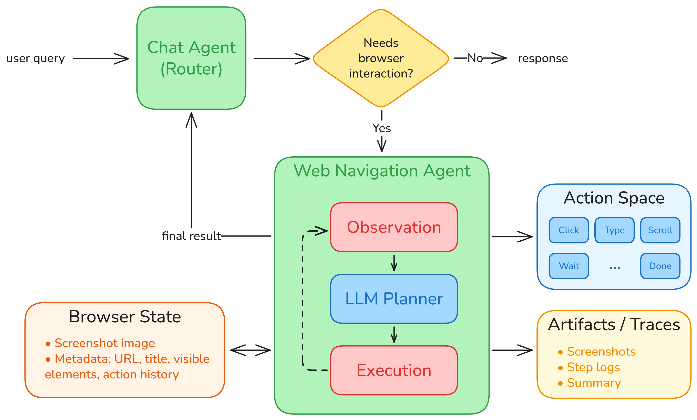
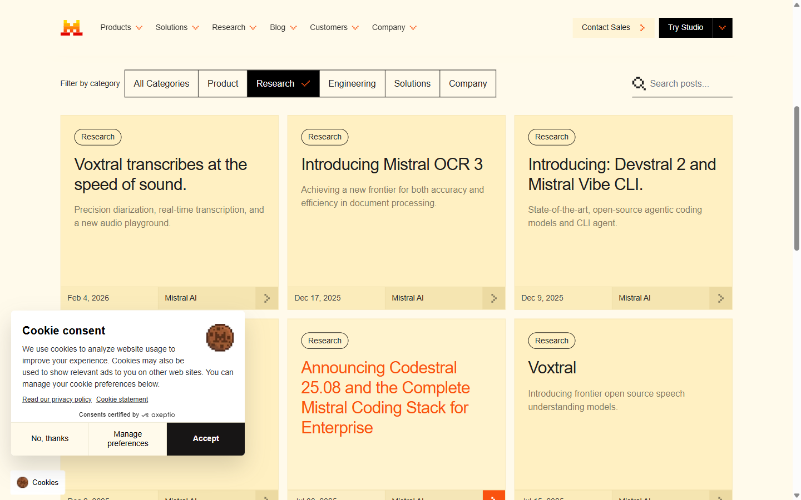
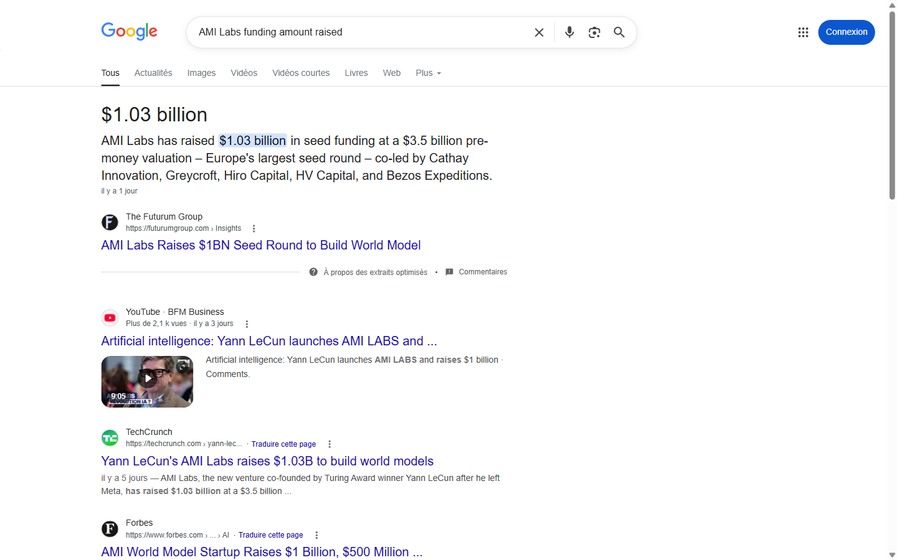
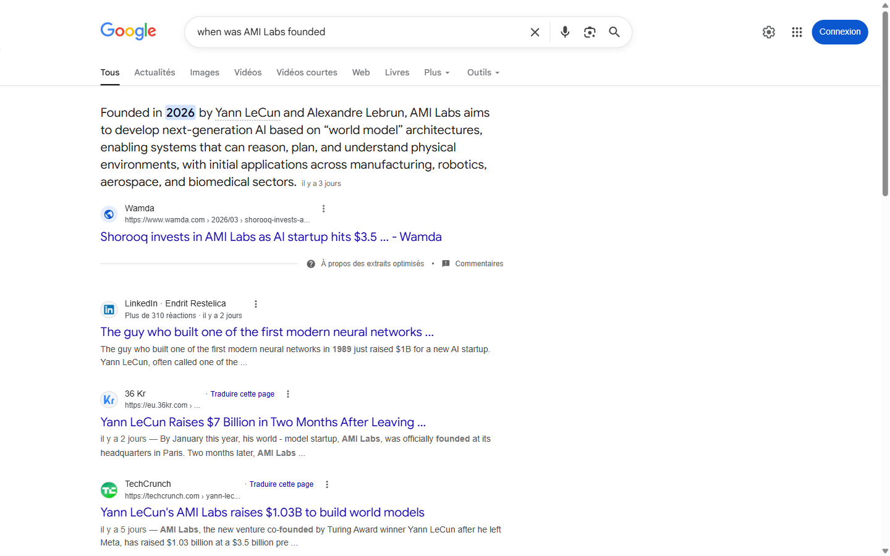

# Web Navigation Agent

A vision browser chat agent project built around a closed-loop interaction pattern:   
`observe -> think -> act -> repeat`

Large language models can do more than generate text. One clear example is a web navigation agent: a system that can open a website, inspect the current page, decide what to do next, take one action, and continue until it finishes a task.

This repo keeps that idea intentionally small and explicit. Instead of hiding everything inside a large framework, it exposes the core loop directly and pairs it with a lightweight chat router on top.



It ships with:

- a chat routing agent
- a vision-based web navigation agent
- a deterministic Playwright execution layer
- a persistent Streamlit chat UI
- a CLI chat mode
- a navigation-only runner
- per-run artifacts for debugging and demos

Author: Marc Haraoui   
Medium blog: [Building a vision-based web navigation agent](https://medium.com/@marcharaoui/building-a-vision-based-web-navigation-agent-d2aa892401df)   
Date: 14 March 2026

## Why This Repo

Many browser-agent demos are either too large to study quickly or too brittle to reuse.

This repo aims for a simpler middle ground:

- one planner
- one browser executor
- one action at a time
- typed outputs
- saved traces for every run

It is small enough to read in one sitting, but complete enough to run real browsing tasks.

This matters because many web tasks are not single-step problems. Finding a product, checking a company fact, navigating documentation, comparing information across pages, or filling part of a form all require a sequence of decisions. Traditional browser automation works well when every step is known in advance. A browser agent is different: it can adapt its next step based on what is currently visible on the page.

## Quickstart

Requirements:

- Python 3.11+
- `uv`
- Playwright Chromium
- an OpenRouter API key

Tested on:

- Windows
- PowerShell
- Python 3.12

Install dependencies:

```bash
uv sync --extra dev
uv run playwright install chromium
```

Create a `.env` file in the repo root:

```env
API_KEY=your_openrouter_api_key
NAV_MODEL_NAME=google/gemini-3-flash-preview
CHAT_MODEL_NAME=google/gemini-3-flash-preview
```

Feel free to use any other vision-language models you prefer. For more information on the available models, visit the [OpenRouter multimodal models page](https://openrouter.ai/models?fmt=cards&input_modalities=text%2Cimage&output_modalities=text).

## Run It

Default Streamlit GUI:

```bash
uv run python main.py
```

Terminal chat mode:

```bash
uv run python main.py cli
```

Nav-only mode:

```bash
uv run python main.py nav --goal "Find the newest model released by Mistral AI" --start-url "https://mistral.ai/news/"
```

Useful flags:

- `--headless`
- `--step-delay-ms`
- `--nav-max-steps`
- `--chat-max-turns`
- `--start-url`
- `--max-steps`

## How It Works

At the center of the project is a simple repeated question:

`Given the goal and the current browser state, what is the next best action?`

That question is answered inside a small closed loop:

1. Capture the current page state.
2. Collect visible interactive elements and a compact text excerpt.
3. Ask the model for exactly one structured action.
4. Execute that action in Playwright.
5. Repeat until `DONE`, `FAIL`, or the step budget is exhausted.

Supported action types:

- `GOTO`
- `CLICK`
- `TYPE`
- `PRESS`
- `SCROLL`
- `WAIT`
- `SELECT`
- `BACK`
- `DONE`
- `FAIL`

## Architecture

The system is built around a few small pieces with clear roles.

### 1. The planner

The model acts as a planner. It receives the goal and the current browser state, then chooses one next action. It does not directly control the browser.

Typical planner outputs are structured and schema-validated, for example:

```json
{
  "thought": "The relevant result is already visible and clicking it should open the target page.",
  "action": {
    "type": "CLICK",
    "element_id": "el-4"
  },
  "expected_outcome": "The browser opens the relevant page."
}
```

This structure makes the system much easier to validate, execute, and debug than free-form text.

### 2. The browser layer

The browser is handled separately with Playwright. The model decides; Playwright executes.

That separation is one of the main design choices in the repo. It keeps the execution layer deterministic and easier to reason about than a system where the model implicitly controls everything.

### 3. What the model sees

At each step, the planner receives a compact observation that includes:

- the current URL
- the page title
- a short content excerpt
- a screenshot when available
- recent action history
- visible interactive elements with generated `element_id` values

This is what makes the agent vision-grounded rather than purely text-driven.

### 4. The action space

The action space stays intentionally compact:

- `GOTO`
- `CLICK`
- `TYPE`
- `PRESS`
- `SCROLL`
- `WAIT`
- `SELECT`
- `BACK`
- `DONE`
- `FAIL`

The key rule is simple: the model chooses one atomic action at a time.

### 5. Artifacts and traces

Each run leaves behind artifacts under `artifacts/runs/<run_id>/`, including:

- `summary.json`
- step JSON logs
- screenshots

This makes failures inspectable instead of mysterious: you can see what the model saw, what it decided, what the browser did, and where the run ended.

## Code Layout

The main modules are:

- `agent.py`: closed-loop navigation
- `browser.py`: Playwright session handling and page observation
- `chatbot.py`: chat routing plus optional navigation handoff
- `llm_adapter.py`: OpenRouter-compatible JSON generation
- `schemas.py`: Pydantic validation for chat and nav outputs
- `streamlit_app.py`: GUI wrapper around the same backend flow

## Demo Runs

The examples below are real saved runs from this repo captured on March 14, 2026.

### Mistral AI Example

Goal:

`Find the newest audio model released by Mistral AI.`

Run artifact:

- `artifacts/runs/20260314_194850_find-the-newest-audio-model-released-by-mistral-ai/`

Result:

`The newest audio model released by Mistral AI is Voxtral, a frontier open-source speech understanding model capable of precision diarization and real-time transcription, released on February 4, 2026.`

Screenshot from the run:



### AMI Labs Example

Goal:

`Find out how much funding AMI Labs has raised.`

Run artifact:

- `artifacts/runs/20260314_194949_find-out-how-much-funding-ami-labs-has-raised/`

Result:

`AMI Labs has raised $1.03 billion in seed funding at a $3.5 billion pre-money valuation.`

Screenshot from the run:



#### Follow-up:

Goal:

`Find out when it was founded.`

Run artifact:

- `artifacts/runs/20260314_195025_find-out-when-it-was-founded`

Result:

`AMI Labs was founded in 2026.`

Screenshot from the run:



## GUI Notes

The Streamlit app keeps the browser session alive while the app is running, so follow-up chat turns can continue from the current page.

The chat UI is intentionally simple:

- the router first decides whether to answer directly or use the browser
- it shows a quick intent update before navigation starts
- the nav agent runs in the background
- the final result is appended to the chat transcript

Reset the session from the sidebar to start with a fresh browser.
You can also set your max steps limit from the sidebar for both the chat and navigation agents.

## Chat Router

On top of the nav loop, the repo also includes a lightweight chat router. Its job is to understand the user's request and decide whether to:

- answer directly
- ask for clarification
- call the navigation agent
- exit the conversation

This keeps the navigation agent focused on browser interaction, while the chat layer handles user intent and follow-up behavior.

## Artifacts

Each run is saved under:

```text
artifacts/runs/<run_id>/
|-- summary.json
|-- screenshots/
`-- steps/
```

This makes failures inspectable:

- what the agent saw
- what it decided
- what the browser executed
- where the run ended

## Tests

Run the test suite with:

```bash
uv run pytest -q tests -p no:cacheprovider
```

Current coverage includes:

- schema validation and shorthand normalization
- JSON cleanup in the LLM adapter
- browser click fallback logic
- Windows Playwright event loop handling
- chat routing helpers
- parser defaults and mode handling
- nav loop defaults

Current status: `31` tests passing.

## Design Choices

- Single-agent navigation loop: easy to reason about and demo
- Deterministic browser layer: the model plans, Playwright executes
- Structured outputs: malformed model responses are validated early
- Saved artifacts: every run leaves behind traces and screenshots
- Shared backend flow: GUI and CLI use the same core chat/nav orchestration

## Limitations

- Not designed to solve CAPTCHAs or anti-bot challenges
- Reliability still depends heavily on the chosen model
- Some sites are noisy, highly dynamic, or hostile to automation
- This is a compact engineering demo, not a benchmarked production agent

## License

MIT. See [`LICENSE`](./LICENSE).

## Disclaimer

*Note: This work is co-authored by both Marc Haraoui and LLM technology.*

